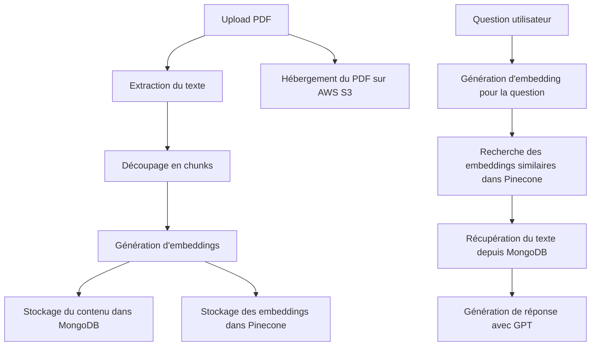

+++
title = 'RAG Chatbot: Késako ? (1/3)'
subtitle = "Chapitre 1: RAG, Késako?"
author = 'writememory1337'
date = 2024-08-12T23:21:24+02:00
draft = false
tags =  ["vulgarisation","Installation", "Configuration"]
categories = ["documentation"]
series_weight = 1
lightgallery = true
featuredImage = "vector1.jpg"
index = false

+++

Cet article est le premier d'une série dans laquelle je détaillerai la création d'un chatbot de type RAG **(Génération Augmentée par la Récupération)**, particulièrement utile pour les requêtes en rapport avec des sujets bien spécifiques (documentation interne de l'entreprise, documents administratifs, etc.)

Dans ce premier article, nous détaillerons le fonctionnement d'un système , en nous concentrant particulièrement sur le traitement des documents PDF.

## Comment ça marche ?

Le processus peut être divisé en deux phases principales: 
1) le traitement des documents 
2) la réponse aux questions des utilisateurs. 





### Phase 1 : Traitement des documents

1. **Upload du PDF** : L'utilisateur upload un document PDF.

2. **Chunking (si nécessaire)** : Les PDF volumineux sont divisés en segments plus petits, appelés "**chunks**", pour un traitement plus efficace.

3. **Extraction du texte du PDF** : Ici nous utilisons **pdfjs-dist** .

4. **Génération d'embeddings** : Le texte extrait est converti en **embeddings**, des vecteurs de valeurs numériques qui représentent un objet.

5. **Stockage du contenu** : Le texte original est stocké dans une base de données (j'utilise ici **MongoDB**) pour préserver le contexte complet.

6. **Stockage des embeddings** : Les **embeddings** sont stockés dans **Pinecone**, une base de données vectorielle optimisée pour la recherche rapide de similitudes.

8. **Hébergement du PDF** : Le fichier PDF original est hébergé sur **AWS S3** (utilse si vous voulez scaler l'application plus tard, et proposer à vos utilisateurs de retélécharger le fichier par exemple)

### Phase 2 : Réponse aux questions

1. **Question de l'utilisateur** : L'utilisateur pose une question au chatbot.

2. **Génération d'embeddings pour la question** : La question est convertie en embedding, utilisant le même processus que pour le contenu du document.

3. **Recherche des embeddings similaires** : Le système recherche dans Pinecone les embeddings les plus similaires à celui de la question.

4. **Récupération du texte** : Le système récupère le texte correspondant aux embeddings similaires depuis MongoDB.

5. **Génération de réponse** : Un LLM (comme GPT) génère une réponse pertinente basée sur le texte récupéré et la question de l'utilisateur.

### Quels avantages?

1) Le système fournit des réponses personnalisées pour chacun de nos utilisateurs (documentation interne introuvable sur le net, docs administratifs...).

2) Simplicité: nos utilisateurs auront simplement à alimenter le chatbot en documents...

3) En combinant la recherche d'informations spécifiques avec des LLM performants, les réponses sont plus précises et pertinentes.

